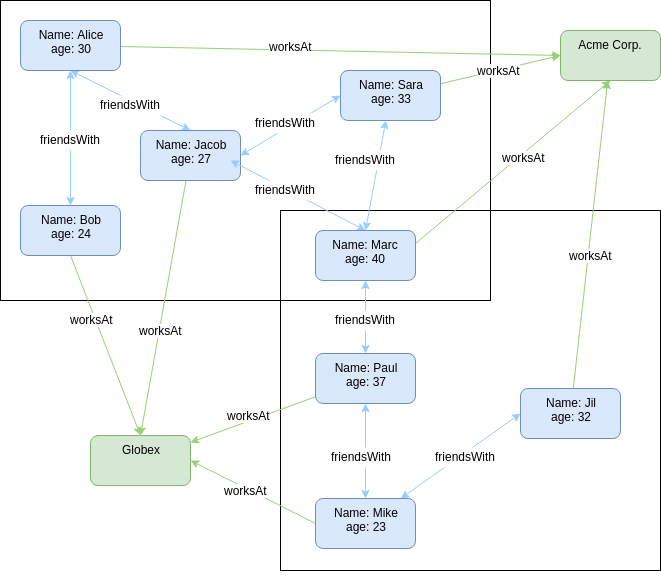

## Gradoop Quickstart

To get started with [Gradoop](http://www.gradoop.com), we will walk through the setup, and 
uss some basic operators on an example graph You can find the whole sourcecode of the quickstart [here](src/main/java/GradoopQuickstart.java).

### Setup

The easiest way to use gradoop in your project is via maven. Add the following repository to your project file:
```
<repositories>
  <repository>
    <id>dbleipzig</id>
    <name>Database Group Leipzig University</name>
    <url>https://wdiserv1.informatik.uni-leipzig.de:443/archiva/repository/dbleipzig/</url>
    <releases>
      <enabled>true</enabled>
    </releases>
    <snapshots>
      <enabled>true</enabled>
    </snapshots>
   </repository>
</repositories>
```
Now maven can resolve the gradoop dependency:
```
<dependency>
  <groupId>org.gradoop</groupId>
  <artifactId>gradoop-flink</artifactId>
  <version>0.3.0-SNAPSHOT</version>
</dependency>
```
You also need Apache Flink (version 1.3.1.):
```
<dependency>
    <groupId>org.apache.flink</groupId>
    <artifactId>flink-java</artifactId>
    <version>1.3.1</version>
</dependency>
<dependency>
    <groupId>org.apache.flink</groupId>
    <artifactId>flink-clients_2.11</artifactId>
    <version>1.3.1</version>
</dependency>
```
Now you are able to run your gradoop application.

### Creating an example graph
In the following examples we will work with a rather simple graph, so each operation and its 
results can easily be understood and visualized. Consider the following graph collections that consists of three logical graphs, describing two groups of friends.

As you can see, there are two types of vertices in our graph collection: _Person_ and _Company_. 
There are also two types of edges: _friend_, denoting that a given _Person_ is friends with 
another, and _worksAt_, a relation between a _Person_ and a _Company_. 
In the Extended Property Graph Model (EPGM), these types are called _labels_.



Each _Person_ has two characteristics a name and and an age, while our companys onyle have a
 name as a property. These key-value pairs are the _properties_ of a graph element. Note that 
 there is no schema involved that forces a certain type of graph element to have specific values.
 E.g. there could be a third company vertex which also holds information about the size of 
 the company or a person with no key-value pair age. 
 
 Both groups of friends make up a separate graph, those are called _logical graph_ in EPGM. Graph
  elements can belong to more than one logical graph. The vertices Marc and Jacob belong to both 
  groups  and since in each group there is at least one person working at each company, they also belong 
  to both logical graphs.  
 
 A set of logical graphs is called a _graph collection_. That's everything we need to know about 
 EPGM for now, if you want to gain a deeper understanding, have a look at the [paper](http://dbs.uni-leipzig.de/file/EPGM.pdf).    


To create the example data we use the GDL format, which is easy to understand and allows 
to build small graph collections from strings. Basically a vertex is given by a pair of 
parentheses `()`and edges are represented with arrow-like symbols `-[]->`. All 
graph elements can be referred to by a variable name, given a label and key-value pairs. Let's have a look at the source code:

```java 
String graph = "g1[(p1:Person {name: \"Bob\", age: 24})-[:friend]->" +
    "(p2:Person{name: \"Alice\", age: 30})-[:friend]->(p1)" +
    "(p2)-[:friend]->(p3:Person {name: \"Jacob\", age: 27})-[:friend]->(p2) " +
    "(p3)-[:friend]->(p4:Person{name: \"Marc\", age: 40})-[:friend]->(p3) " +
    "(p4)-[:friend]->(p5:Person{name: \"Sara\", age: 33})-[:friend]->(p4) " +
    "(p5)-[:friend]->(p4)-[:friend]->(p5) " + "(c1:company {name: \"Acme Corp\"}) " +
    "(c2:company {name: \"Globex Inc.\"}) " + "(p5)-[:worksAt]->(c1) " +
    "(p3)-[:worksAt]->(c1) " + "(p2)-[:worksAt]->(c1) " + "(p1)-[:worksAt]->(c2) " +
    "(p4)-[:worksAt]->(c2) " + "] " +
    "g2[(p4)-[:friend]->(p6:Person {name: \"Paul\", age: 37})-[:friend]->(p4) " +
    "(p3)-[:friend]->(p7:Person {name: \"Mike\", age: 23})-[:friend]->(p3) " +
    "(p6)-[:friend]->(p7)-[:friend]->(p6) " +
    "(p8:Person {name: \"Jil\", age: 22})-[:friend]->(p7)-[:friend]->(p8) " +
    "(p6)-[:worksAt]->(c2) " + "(p7)-[:worksAt]->(c2) " + "(p8)-[:worksAt]->(c1) " + "]";
      
    FlinkAsciiGraphLoader loader = new FlinkAsciiGraphLoader(cfg);
    loader.initDatabaseFromString(graph);
      
    LogicalGraph g1 = loader.getLogicalGraphByVariable("g1");
    LogicalGraph g2 = loader.getLogicalGraphByVariable("g2");
```
Note that the edges of Type friend in our example are undirected, to model this property we use 
two mirrored directed edges.  
You can find detailed information about GDL on [github](https://github.com/s1ck/gdl).
Obviously real world data won't be available in this format. We will cover data importing 
later on and use this example to familiarize  with the gradoop operators.

### Graph Operators
With the overlap operator we can find all elements that are contained in both our logical 
graphs:
```java
LogicalGraph overlap = n2.overlap(n1);
```
To review and validate the results we will use the `DOTDataSink` to write the result graphs in 
the dot format which can be compiled into an image with [Graphviz](https://www.graphviz.org/). 
```java
public static void writeAsDotGraph(String path, LogicalGraph graph) throws Exception{
  DataSink sink = new DOTDataSink("path", true);
  graph.writeTo(sink);
}
```

// TODO result image

The remaining set operators combination, exclusion and equality are straightforward to
 understand from here. You can try them out and observe the results with the method given above. 

### Creating a company based graph 


// TODO change to simpler operations

Let's try a slightly more complicated example. How can we transform our current input graphs to 
achieve two graphs that show the members of each company? At first we need to combine the existing 
graphs to a single graph.In the second step we search for graphs that match a current 
pattern, persons that work at a company. This can be achieved with a [Cypher](https://neo4j.com/developer/cypher-query-language/), a query language for
 graphs: 
```
MATCH (p:Person)-[:worksAt]->(c:Company)
```
You can read more about the implementation of Cypher in Gradoop [here](https://dbs.uni-leipzig.de/file/GRADES17_Cypher_in_Gradoop.pdf).

Running this query gives us a collection of logical graphs each consisting of a person pointing 
to a company. To get our result we reduce the collection to a single graph and split this graph 
by connected components. 
// TODO explain reduce and cc/gelly  

Although we could use a range of different operators and got the desired result, this is probably
 not the most concise an efficient way. Can you come up with other and/or a simpler solutions? 
 You could start by using the subgraph operator instead of a cypher query.


### Next Steps 

* Review the [Examples](https://github.com/dbs-leipzig/gradoop/tree/master/gradoop-examples)
* Learn about advanced methods e.g. Cypher Queries, ...
* How to import Data from relational Datasources